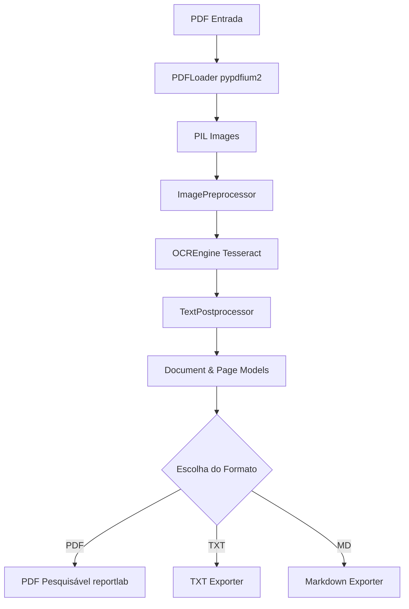

# Arquitetura do OCR PDF CLI

Este documento descreve a organização interna e o fluxo de dados da ferramenta **ocr-pdf-cli**.

A arquitetura foi projetada para ser modular, robusta e extensível, com total desacoplamento entre a interface CLI e as regras de negócio de OCR, permitindo futuras integrações como uma interface web PWA (`ocr-pdf-pwa`).

## Componentes

A estrutura do código-fonte está organizada da seguinte forma:

```text
src/ocr_pdf_cli/
├── cli/           # Interface CLI (Typer e Rich)
├── config/        # Configurações globais centralizadas
├── core/          # Pipeline principal de processamento de PDFs
├── engines/       # Mecanismos de OCR (Tesseract, EasyOCR, PaddleOCR)
├── exporters/     # Exportadores de formatos de saída (PDF, TXT, MD)
├── models/        # Modelos de dados usando Pydantic
└── utils/         # Utilitários (logs, sistema, arquivos temporários)
```

## Fluxo de Processamento (Pipeline)

O pipeline de execução (`OCRPipeline`) coordena as seguintes fases sequenciais:

1. **Leitura e Renderização (`PDFLoader`):** O arquivo PDF de entrada é aberto através do `pypdfium2`. Cada página é renderizada em uma imagem (objeto PIL `Image`) na resolução configurada (DPI).
2. **Pré-processamento (`ImagePreprocessor`):** Aplica transformações como escala de cinza e binarização opcional na imagem renderizada para otimizar o reconhecimento dos caracteres pelo motor de OCR.
3. **Reconhecimento de OCR (`OCREngine`):** A engine escolhida (como `TesseractEngine`) recebe a imagem e extrai o texto completo e a posição/dimensão de cada palavra detectada.
4. **Pós-processamento de Texto (`TextPostprocessor`):** Limpa ruídos gerados no OCR, corrigindo espaços em branco duplicados, quebras excessivas de linha e removendo caracteres de controle invisíveis.
5. **Exportação (`exporters/`):** Com base no formato solicitado pelo usuário, o documento estruturado em modelos Pydantic é exportado para um arquivo físico de saída:
   - **PDF:** Utiliza o `reportlab` para recompor o arquivo adicionando uma camada oculta de texto sobre as páginas de imagens originais, tornando-o pesquisável e indexável.
   - **TXT:** Exporta o texto puro, delimitando as quebras de página.
   - **Markdown:** Estrutura o documento em Markdown separando os conteúdos por seções correspondentes a cada página.



## Modelos de Dados (Pydantic)

Os dados são transportados e validados entre os módulos utilizando os seguintes modelos de dados:

* **OCRWord:** Representa uma palavra individual com coordenadas `left`, `top`, `width`, `height` em pixels e o nível de `confidence`.
* **OCRResult:** Consolida o texto bruto extraído da página e a lista de `OCRWord` associada.
* **Page:** Modela uma página específica, mapeando o número da página, dimensões físicas em pontos PDF (`width` e `height`), caminho da imagem temporária (`image_path`) e o `OCRResult`.
* **Document:** Agrupa o caminho do arquivo de origem, metadados globais e a lista ordenada de objetos `Page`.
